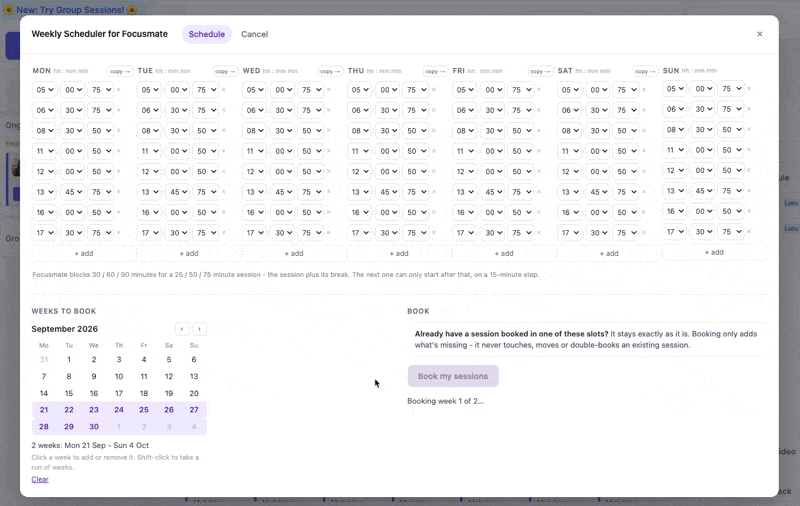
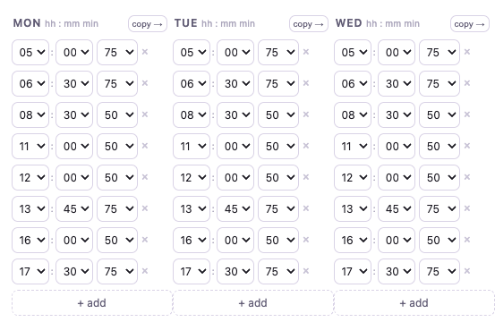
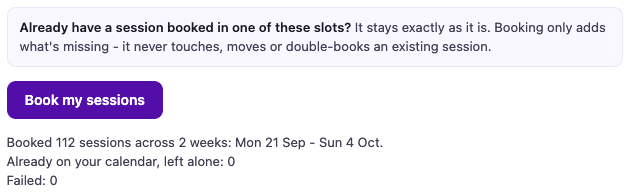

# Focusmate Scheduler

**Book three months of [focusmate.com](https://www.focusmate.com) sessions in
five seconds.**

An unofficial Chrome extension for people who sit down at the same times every
week.



## Why this exists

I do nine Focusmate sessions a day, at the same times, every day of the week.
Focusmate has no repeat booking - so every week I sat there clicking the same
grid again, one session at a time, and every week I got it slightly wrong:
missed a slot, booked the wrong duration, or gave up halfway and left holes in
the week.

It is maybe five minutes. Five minutes, every week, forever, doing something a
computer should obviously do. So I wrote down my week once, and now I press a
button and the next quarter is booked.

If your Focusmate week is different every time, you don't need this. If it's the
same every week, this is five seconds instead of five minutes.

Unofficial and unaffiliated. It drives Focusmate's own web API from your own
browser, signed in as you - there is no server, no account and no config file.

## What it does

Click the toolbar button on `app.focusmate.com` and a panel opens with two tabs.

**Schedule** - seven day-columns, up to 10 sessions a day. Start times are
dropdowns on Focusmate's 15-minute grid, with a 25 / 50 / 75 minute duration.
`copy →` copies a day into the next one, so a five-day week takes four clicks.



Then pick the weeks on the calendar - click a week to add or remove it,
shift-click to take a run of them - and press Book. Weeks past Focusmate's
13-week horizon are struck through, because nothing can be booked beyond them.

Clashes are caught as you type, on the real footprint: Focusmate blocks 30 / 60
/ 90 minutes for a 25 / 50 / 75 minute session, because each one is followed by
a break. So after a 75 minute session at 05:00, the next bookable start is
06:30, not 06:15 - and the editor says so instead of letting the booking fail.

Sessions you already hold are left exactly as they are. Booking only adds what
is missing - it never moves or double-books anything.



**Cancel** - pick weeks the same way, see how many sessions fall inside them,
and cancel them all. Weeks you didn't pick are untouched. This cannot be undone.

Your schedule is saved in the browser, so the next click starts from where you
left off. Nothing books by itself - you always press the button.

## Don't trust it - check it

You are about to give a stranger's extension access to your Focusmate account.
You should not take my word for anything. Two ways to check, both cheap:

**Read it yourself.** The whole extension is about 1,400 lines of plain
JavaScript across six files, with no build step, no minification and no
dependencies. What's in this repo is exactly what runs. `focusmate/api.js` is
the only file that talks to the network - it's under 200 lines, and every
request it can make is in there.

**Or have an LLM read it for you.** Paste this into Claude, ChatGPT or whatever
you use:

```
Review this Chrome extension for me:
https://github.com/alchemicwebstudio/focusmate-scheduler

I want to know, specifically:
1. Can it see or send my password anywhere?
2. What data leaves my browser, and to which domains?
3. Does it send anything to the author, or to any analytics or tracking service?
4. Could it do anything to my Focusmate account other than book and cancel
   sessions - delete my account, change settings, message people?
5. Is there anything in it that runs on its own, without me clicking a button?

Read the actual files, especially focusmate/api.js and focusmate/main.js.
Quote the lines you base each answer on.
```

Ask it to quote lines. An answer with no line references is an answer worth
ignoring.

What neither check can tell you: whether Focusmate minds. This uses the same
endpoint their own website uses, as you, but it isn't a sanctioned integration,
and nobody can promise you how they'd feel about it. That risk is yours, mine
and everyone's alike.

For what it's worth, booking this way asks *less* of their servers than doing it
by hand - a batch of 30 sessions is one request where clicking is many, and the
whole thing is deliberately paced. So: flattered rather than flustered, I hope.

## Install

Chrome doesn't have a one-click install for extensions that aren't in the Web
Store, so it's a folder on your computer that Chrome loads. Five minutes, and
you never have to do it again.

1. On this page, click the green **Code** button, then **Download ZIP**.
2. Unzip it. You'll get a folder with a `focusmate` folder inside it.
3. **Put that folder somewhere permanent** - your Documents, say. Chrome loads
   the extension from wherever it sits, so if you delete it or empty it from
   Downloads, the extension disappears.
4. In Chrome, go to `chrome://extensions` (type it in the address bar).
5. Turn on **Developer mode** - the switch in the top right.
6. Click **Load unpacked**, and select the `focusmate` folder - the one that has
   `manifest.json` inside it, not the folder above it.
7. Open [app.focusmate.com](https://app.focusmate.com) and sign in.
8. Click the **FS** icon in your toolbar. If you can't see it, click the puzzle
   piece icon and pin it.

Chrome will show a "Disable developer mode extensions" warning now and then.
That's Chrome's blanket warning for anything not from the Web Store, not a
warning about this extension. You can dismiss it.

**To update later:** download the new ZIP, replace the old folder with the new
one, and press the reload arrow on the extension's card in `chrome://extensions`.

## Time zones

Everything is your computer's local time. A schedule row saying `08:30` means
08:30 where you are, and that's what gets booked.

Two things follow from that:

- **Daylight saving is handled.** Book a run of weeks across a clock change and
  every session stays at its wall-clock time - 08:30 before the change, 08:30
  after, not 07:30.
- **Travel doesn't rewrite what you already booked.** Sessions are booked at a
  fixed moment in time. If you fly somewhere and your computer's clock changes,
  the sessions you booked before you left stay at the time they were booked -
  which will now read differently to you. Book after you land, not before, if
  you want your new local hours.

## What it touches

It reads the session token your browser already holds for Focusmate, out of the
page's own storage - the same token the site uses for every request you make.
When that token is near expiry it refreshes it against Google's token service,
exactly as Focusmate itself does.

The token is then sent only to Focusmate and to that Google endpoint - the two
places your browser already sends it - and only on requests you triggered by
pressing a button. There is no server of mine, no analytics, and no third
destination of any kind. Your password is never involved.

The only thing kept on disk is your weekly schedule, in this browser profile's
local extension storage.

## Notes

- Booking is sent in batches of 30 sessions, cancelling one request per session,
  both paced - it does not hammer Focusmate.
- Focusmate's [public API](https://apidocs.focusmate.com/) is read-only today,
  so booking goes through the same endpoint the website itself uses.

## Licence

MIT - see [LICENSE](LICENSE).

Focusmate is a trademark of Focusmate, Inc. This project is not affiliated with,
endorsed by, or supported by Focusmate. I do love Focusmate a lot, though.
